# Arkfield

Arkfield 是一个以《明日方舟：终末地》的设计风格为参考，面向长文阅读和编辑 Typora 浅色主题。

## 覆盖范围

- 文档：1~6 级标题、正文、链接、列表/任务列表、引用、Alerts、表格、代码、YAML、原始 HTML、目录、脚注、图片/媒体、MathJax 4 和 Mermaid。
- 编辑：Markdown 元字符、搜索/选区、源码模式、代码/数学/表格/目录/原始块编辑面板，以及 Typora 1.14+ 的编辑工具栏。
- 应用外壳：侧边栏、文件树/列表、大纲与全局搜索、快速打开、通知、菜单、对话框、状态栏、偏好设置、主题选择和 Typora 1.14+ 预览模式。
- 导出：HTML、图片、打印/PDF；打印规则单独处理分页、长表格、代码换行和背景色还原。

完整格式与中日英混排效果见 [主题展示文档](assets/coverage.md)——在 Typora 中使用 Arkfield 打开该文件，可以检查正文、组件、扩展语法与导出分页。

Word、OpenDocument、LaTeX 等 Pandoc 导出走独立模板/转换链，不能保证使用主题 CSS，详见 [Typora 导出文档](https://support.typora.io/Export/)。

主题自带三份可变字体：正文拉丁用 Inter，标题与技术标签用 Space Grotesk，代码用 Fira Code，CJK 统一走系统字体栈。

<details>
<summary><strong>预览</strong></summary>

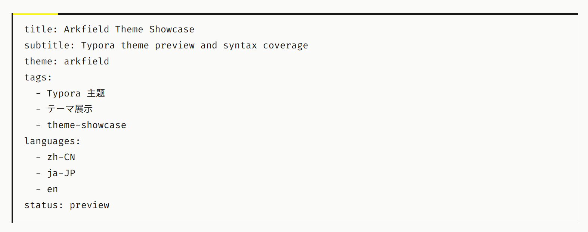

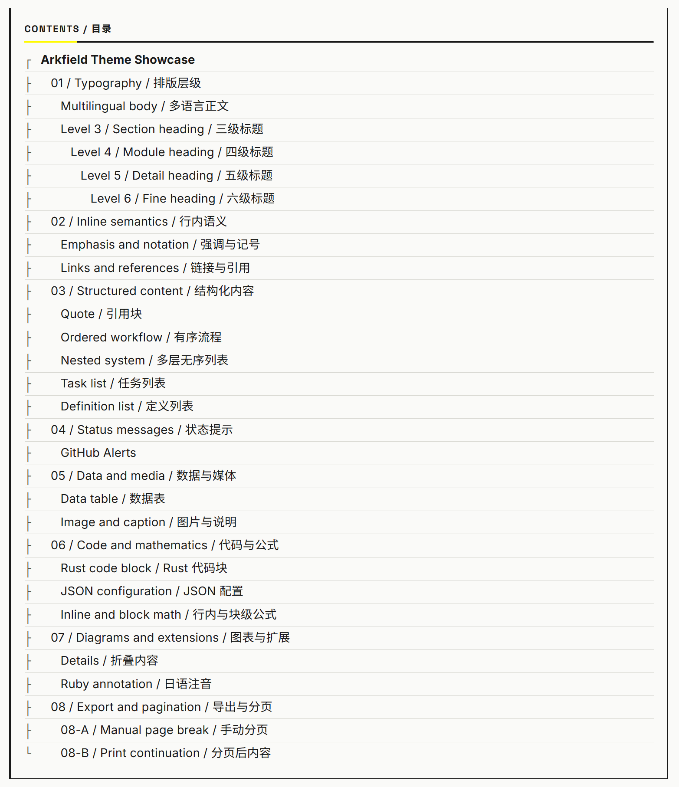

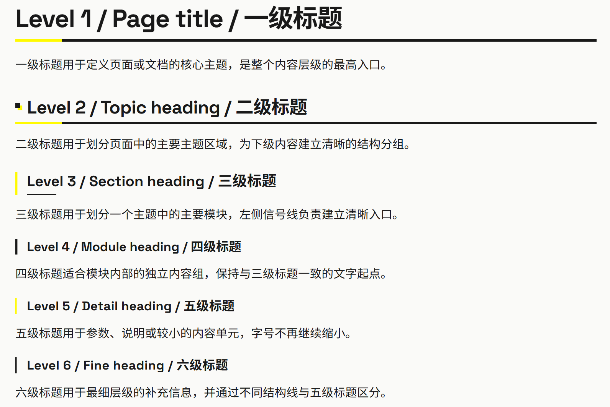

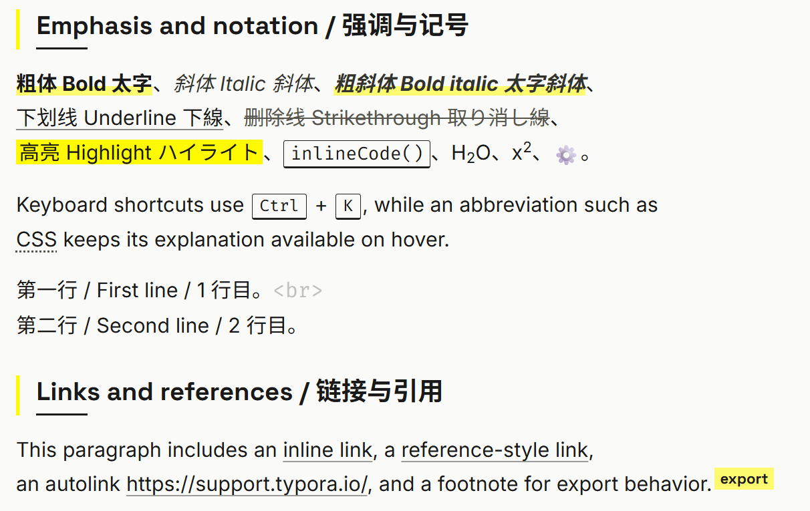

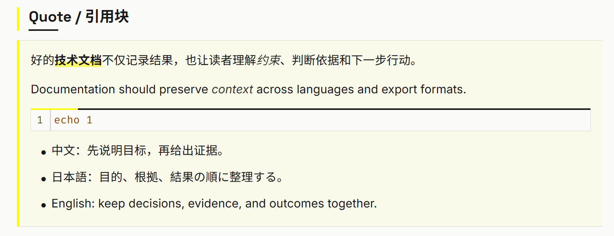

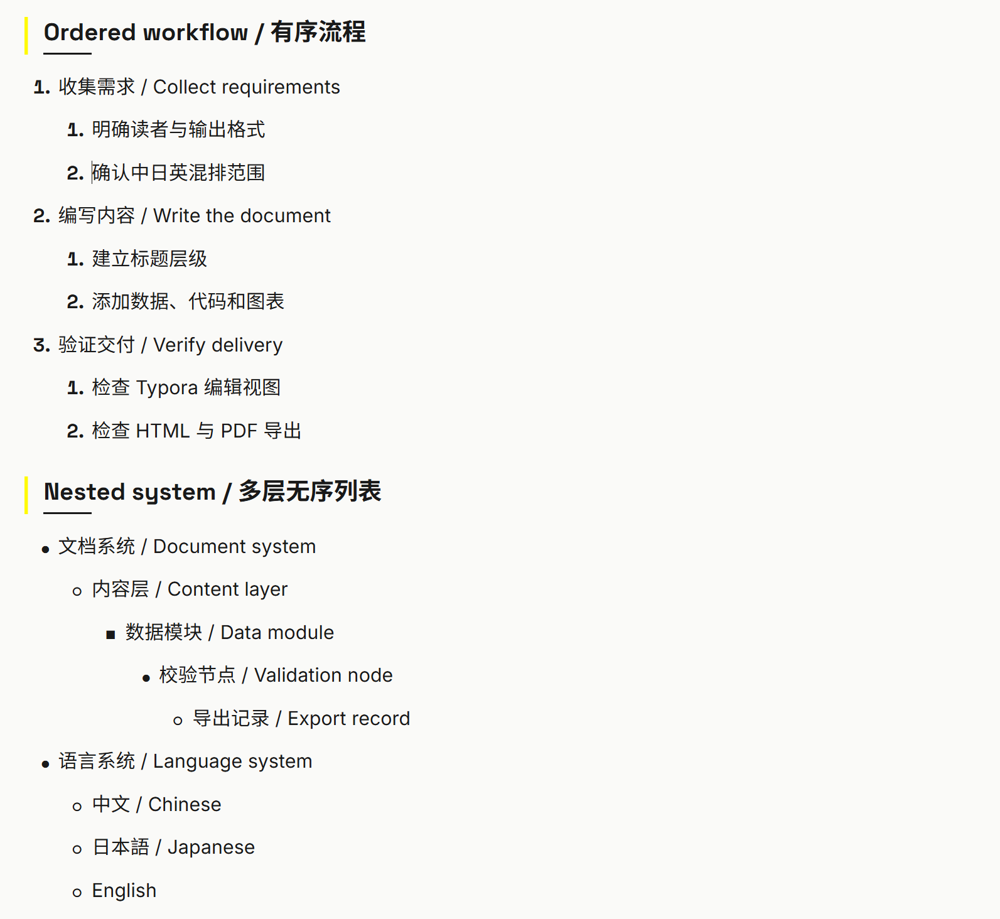

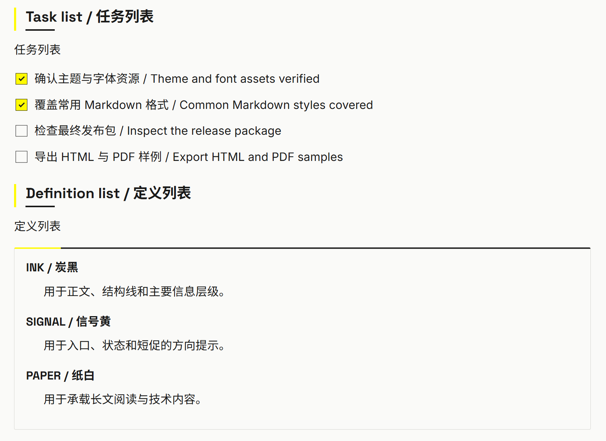

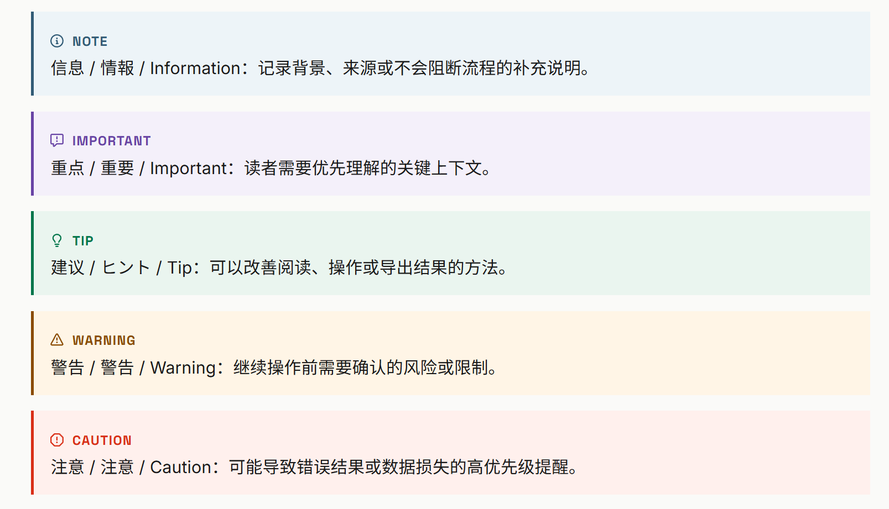

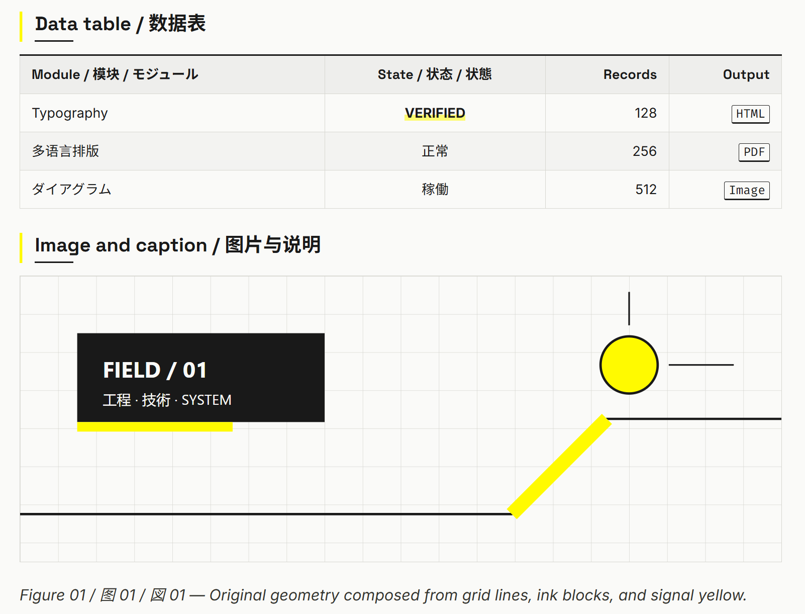

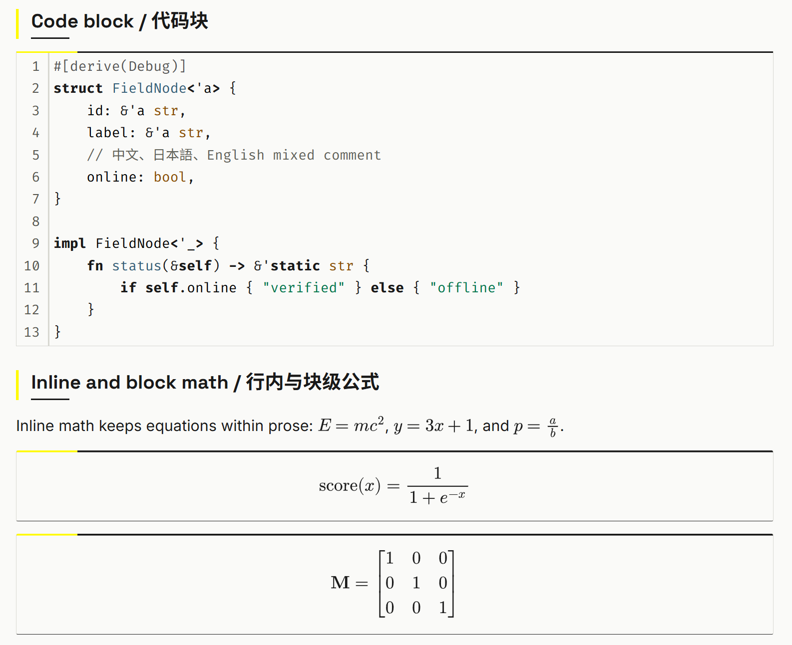

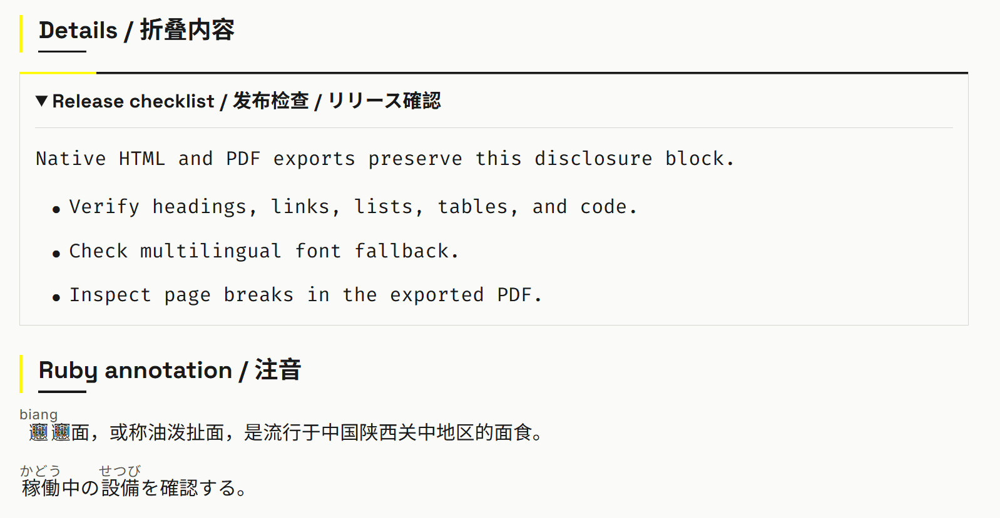

</details>

## 安装

从 [Releases](../../releases) 下载 zip 并解压。

1. 在 Typora 中打开“文件 → 偏好设置 → 外观 → 打开主题文件夹”
2. 把解压后的所有文件复制到该目录
3. 重启 Typora，在“主题”菜单选择 `Arkfield`

## 开发

通过 [mise](https://mise.jdx.dev/getting-started.html) 管理：

```shell
mise install
mise run build
mise run check
mise run fmt
```

`arkfield.scss` 是唯一需要维护的主题样式源码；构建产物为 `theme/*`。源码用 Sass 编写。

修改 Sass 后重新编译并覆盖 CSS 与字体目录，并重新启动 Typora。通过“视图 → 开发者工具”检查编辑区和应用界面。导出问题应分别用 HTML 与 PDF 验证。

## 参考

- [Ark UI Skill](https://github.com/Brandon030722/ark-ui-skill)
- [编写自定义主题](https://theme.typora.io/doc/zh/Write-Custom-Theme/)
- [添加自定义 CSS](https://support.typora.io/Add-Custom-CSS/)
- [Typora 1.14 新功能](https://support.typora.io/What%27s-New-1.14/)
