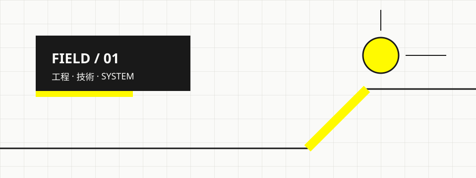
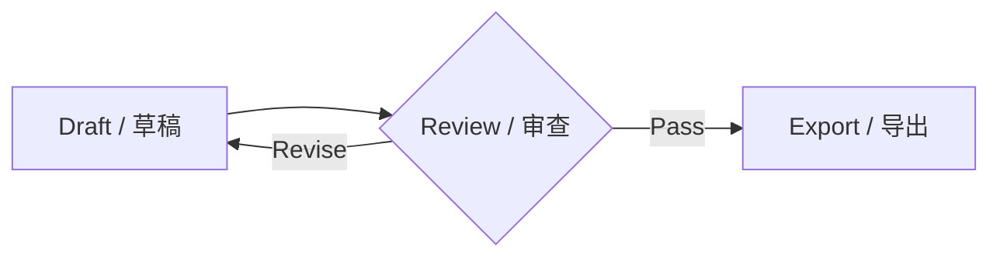
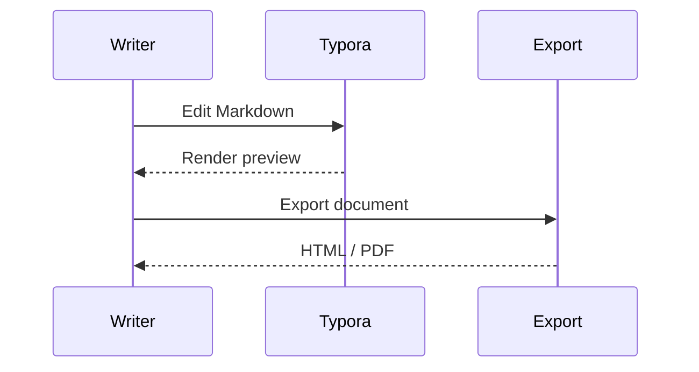
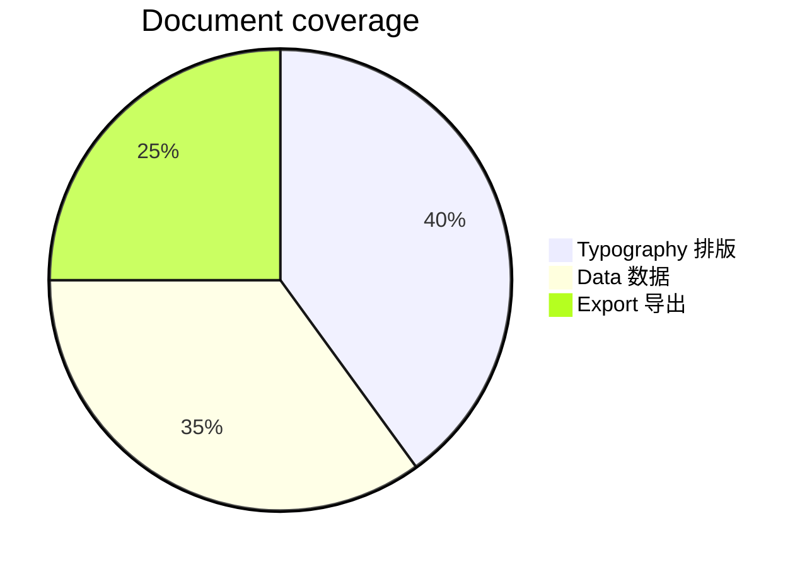
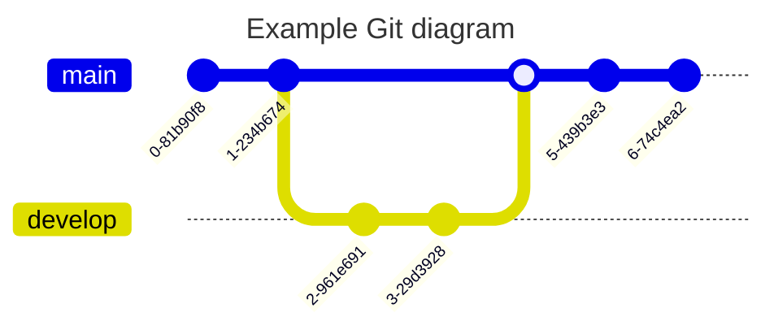

---

# Arkfield Theme Showcase

**FIELD DOCUMENT / 主题展示 / テーマショーケース**

Arkfield 是一款面向技术写作的 Typora 主题，以纸白、炭黑和信号黄构成清晰、克制的工程化视觉语言。

Arkfield は、技術文書のために設計された Typora テーマです。中国語・日本語・英語が混在する文章でも、安定した階層と読みやすさを保ちます。

Arkfield is a Typora theme for technical documents, multilingual notes, study guides, and export-ready reports.

[TOC]

## 01 / Typography / 排版层级

### Multilingual body / 多语言正文

<span lang="zh-CN">中文排版需要清楚的标点、稳定的字重，以及适合长文阅读的行距。</span>

<span lang="ja">日本語の組版では、漢字・かな・句読点が混在しても自然なリズムを保つ必要があります。</span>

<span lang="en">English typography benefits from a steady baseline, restrained emphasis, and readable technical labels.</span>

### Level 3 / Section heading / 三级标题

三级标题用于划分一个主题中的主要模块，左侧信号线负责建立清晰入口。

#### Level 4 / Module heading / 四级标题

四级标题适合模块内部的独立内容组，保持与三级标题一致的文字起点。

##### Level 5 / Detail heading / 五级标题

五级标题用于参数、说明或较小的内容单元，字号不再继续缩小。

###### Level 6 / Fine heading / 六级标题

六级标题用于最细层级的补充信息，并通过不同结构线与五级标题区分。

## 02 / Inline semantics / 行内语义

### Emphasis and notation / 强调与记号

**粗体 Bold 太字**、_斜体 Italic 斜体_、_**粗斜体 Bold italic 太字斜体**_、
<u>下划线 Underline 下線</u>、~~删除线 Strikethrough 取り消し線~~、
==高亮 Highlight ハイライト==、`inlineCode()`、H<sub>2</sub>O、x<sup>2</sup>、:gear:。

Keyboard shortcuts use <kbd>Ctrl</kbd> + <kbd>K</kbd>, while an abbreviation such as
<abbr title="Cascading Style Sheets">CSS</abbr> keeps its explanation available on hover.

第一行 / First line / 1 行目。<br>
第二行 / Second line / 2 行目。

### Links and references / 链接与引用

This paragraph includes an [inline link](https://typora.io/), a [reference-style link][theme-doc],
an autolink <https://support.typora.io/>, and a footnote for export behavior.[^export]

## 03 / Structured content / 结构化内容

### Quote / 引用块

> 好的**技术文档**不仅记录结果，也让读者理解*约束*、判断依据和下一步行动。
>
> Documentation should preserve _context_ across languages and export formats.
>
> ```shell
> echo 1
> ```
>
> - 中文：先说明目标，再给出证据。
> - 日本語：目的、根拠、結果の順に整理する。
> - English: keep decisions, evidence, and outcomes together.

### Ordered workflow / 有序流程

有序列表

1. 收集需求 / Collect requirements
   1. 明确读者与输出格式
   2. 确认中日英混排范围
2. 编写内容 / Write the document
   1. 建立标题层级
   2. 添加数据、代码和图表
3. 验证交付 / Verify delivery
   1. 检查 Typora 编辑视图
   2. 检查 HTML 与 PDF 导出

### Nested system / 多层无序列表

无序列表

- 文档系统 / Document system
  - 内容层 / Content layer
    - 数据模块 / Data module
      - 校验节点 / Validation node
        - 导出记录 / Export record
- 语言系统 / Language system
  - 中文 / Chinese
  - 日本語 / Japanese
  - English

### Task list / 任务列表

任务列表

- [x] 确认主题与字体资源 / Theme and font assets verified
- [x] 覆盖常用 Markdown 格式 / Common Markdown styles covered
- [ ] 检查最终发布包 / Inspect the release package
- [ ] 导出 HTML 与 PDF 样例 / Export HTML and PDF samples

### Definition list / 定义列表

定义列表

<dl>
  <dt>INK / 炭黑</dt>
  <dd>用于正文、结构线和主要信息层级。</dd>
  <dt>SIGNAL / 信号黄</dt>
  <dd>用于入口、状态和短促的方向提示。</dd>
  <dt>PAPER / 纸白</dt>
  <dd>用于承载长文阅读与技术内容。</dd>
</dl>

## 04 / Status messages / 状态提示

### GitHub Alerts

提示

> [!NOTE]
> 信息 / 情報 / Information：记录背景、来源或不会阻断流程的补充说明。

> [!IMPORTANT]
> 重点 / 重要 / Important：读者需要优先理解的关键上下文。

> [!TIP]
> 建议 / ヒント / Tip：可以改善阅读、操作或导出结果的方法。

> [!WARNING]
> 警告 / 警告 / Warning：继续操作前需要确认的风险或限制。

> [!CAUTION]
> 注意 / 注意 / Caution：可能导致错误结果或数据损失的高优先级提醒。

## 05 / Data and media / 数据与媒体

### Data table / 数据表

数据表

| Module / 模块 / モジュール | State / 状态 / 状態 | Records |  Output |
| :------------------------- | :-----------------: | ------: | ------: |
| Typography                 |    **VERIFIED**     |     128 |  `HTML` |
| 多语言排版                 |        正常         |     256 |   `PDF` |
| ダイアグラム               |        稼働         |     512 | `Image` |

### Image and caption / 图片与说明

图片



_Figure 01 / 图 01 / 図 01 — Original geometry composed from grid lines, ink blocks, and signal yellow._

## 06 / Code and mathematics / 代码与公式

### Rust code block / Rust 代码块

Rust 代码块

```rust
#[derive(Debug)]
struct FieldNode<'a> {
    id: &'a str,
    label: &'a str,
    // 中文、日本語、English mixed comment
    online: bool,
}

impl FieldNode<'_> {
    fn status(&self) -> &'static str {
        if self.online { "verified" } else { "offline" }
    }
}
```

### JSON configuration / JSON 配置

JSON 代码块

```json
{
  "theme": "arkfield",
  "languages": ["zh-CN", "ja-JP", "en"],
  "export": ["html", "pdf"],
  "verified": true
}
```

<!-- Editor-only comment styling is intentionally absent from exported output. -->

### Inline and block math / 行内与块级公式

Inline math keeps equations within prose: $E = mc^2$, $y = 3x + 1$, and $p = \frac{a}{b}$.

$$
score(x) = \frac{1}{1 + e^{-x}}
$$

$$
\mathbf{M} =
\begin{bmatrix}
1 & 0 & 0 \\
0 & 1 & 0 \\
0 & 0 & 1
\end{bmatrix}
$$

## 07 / Diagrams and extensions / 图表与扩展

### Flowchart / 流程图

流程图



### Sequence diagram / 时序图

时序图



### Pie chart / 饼图

饼图



### Git Graph



### Details / 折叠内容

折叠内容

<details>
  <summary>Release checklist / 发布检查 / リリース確認</summary>
  <p>Native HTML and PDF exports preserve this disclosure block.</p>
  <ul>
    <li>Verify headings, links, lists, tables, and code.</li>
    <li>Check multilingual font fallback.</li>
    <li>Inspect page breaks in the exported PDF.</li>
  </ul>
</details>

### Ruby annotation / 注音

<span lang="zh-CN"><ruby>𰻞<rt>biang</rt></ruby>𰻞面，或称油泼扯面，是流行于中国陕西关中地区的面食。</span>

<span lang="ja"><ruby>稼働<rt>かどう</rt></ruby>中の<ruby>設備<rt>せつび</rt></ruby>を確認する。</span>

## 08 / Export and pagination / 导出与分页

### 08-A / Manual page break / 手动分页

Native HTML and PDF exports use the selected Typora theme. Pandoc-backed formats may use separate templates and conversion rules.[^export]

The line below is an explicit page break. Its label is visible in the editor and hidden from printed output.

<div style="page-break-after: always;"></div>

### 08-B / Print continuation / 分页后内容

This heading begins after the explicit page break so pagination, heading continuity, and print margins can be inspected.

主题展示到此结束。The showcase ends here. テーマショーケースはここまでです。

[theme-doc]: https://theme.typora.io/doc/Write-Custom-Theme/ "Typora theme documentation"

[^export]: Native Typora HTML and PDF exports retain the selected theme; other export pipelines may apply their own templates.
